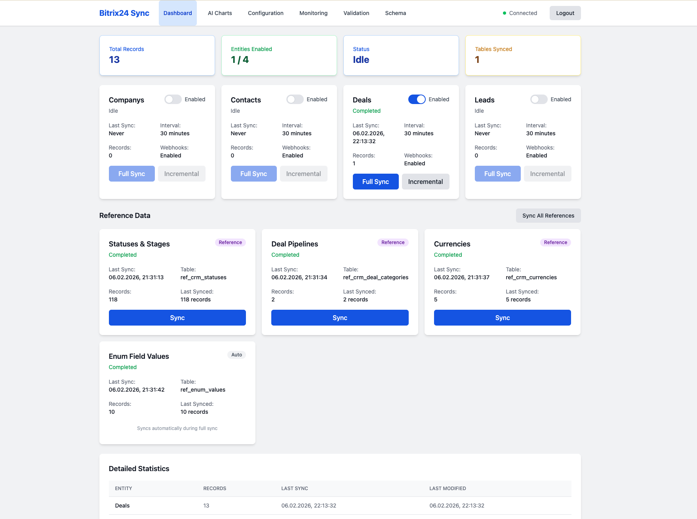
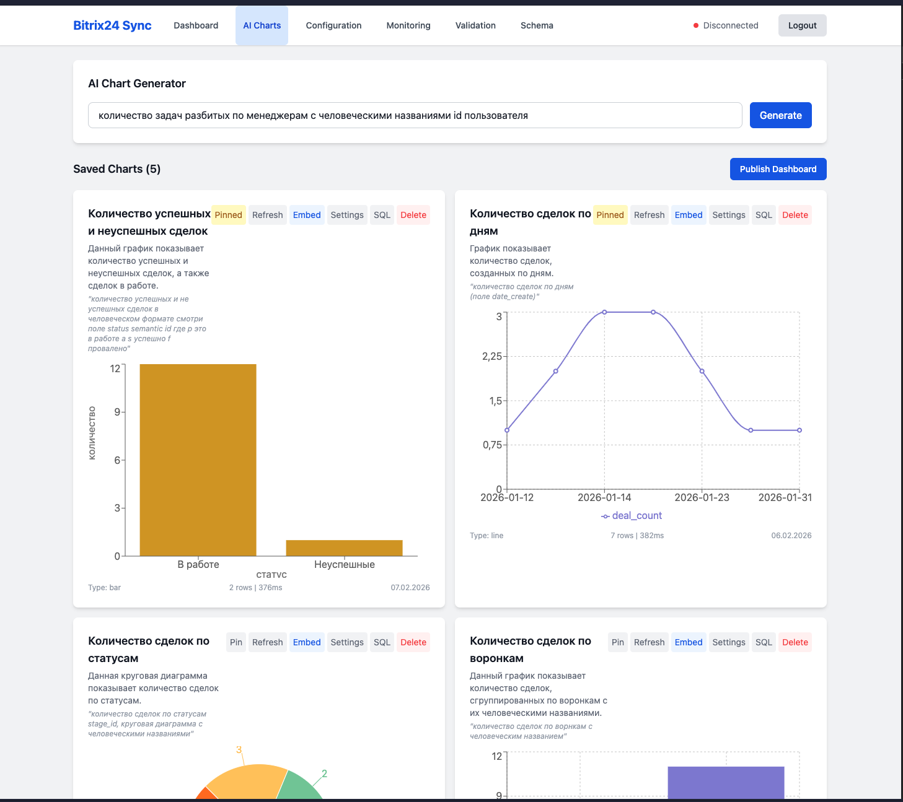

сервис переходи на новую версию, смотри папку new_version





# Bitrix to Postgres Connector

Сервис для синхронизации данных между Bitrix24 и PostgreSQL.
получает данные из Bitrix24 и записывает в PostgreSQL
- Сделки
- Лиды
- Контакты
- Комментарии к задачам
- Результаты задач
- События
- Задачи
- Пользователи
- Смарт-процессы
- Справочники
- Подразделения

## AI-чарты и аналитика (new_version)

Новая версия включает встроенную систему генерации чартов на основе данных CRM:

- **AI-генерация чартов** — опишите на естественном языке какой график нужен, AI сгенерирует SQL-запрос и конфигурацию чарта
- **Типы чартов** — bar, line, pie, area, scatter (через Recharts)
- **Настройка отображения** — оси, легенда, сетка, цвета, формат значений, тип линий
- **Сохранение и закрепление** — CRUD для чартов, возможность закрепить важные наверху
- **Дашборды** — публикация наборов чартов как дашбордов с защитой паролем и embed через iframe
- **Схема БД** — автоматическое описание структуры таблиц: AI-генерация (OpenAI) или быстрая генерация из метаданных БД (без AI)
- **Справочники** — автоматическая синхронизация статусов, воронок, валют и enum-значений для корректных JOIN-ов в чартах

## права доступа
crm, 

## Компоненты
- FastAPI сервис
- Airflow для управления задачами
- PostgreSQL для хранения данных

## Установка и запуск
1. Убедитесь, что у вас установлен Docker и Docker Compose
2. Создайте файл .env с необходимыми переменными окружения
3. Запустите сервисы командой: `docker-compose -f docker-compose-airflow.yml up -d`
4. Добавьте в crontab команду для запуска скрипта очистки логов: `0 0 * * * /home/user/bitrix-to-postgres/bitrix_to_postgres/cleanup_logs.sh >> /home/user/bitrix-to-postgres/bitrix_to_postgres/cleanup_logs.log 2>&1`
## Установка и запуск new_version
```bash
cd new_version
docker-compose up -d
```